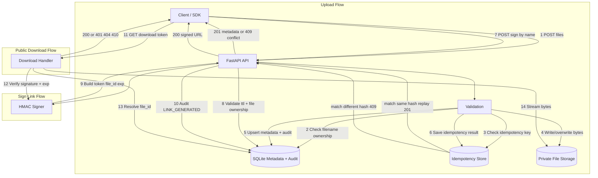

# Secure File Sharing REST API - Architecture

## Notes

- Customer-facing API is filename-based; internal storage and tokens use internal `file_id`.
- Idempotency protects large upload retries (`Idempotency-Key` + request hash).
- Duplicate filenames return `409` unless `X-Overwrite-If-Exists: true`.
- Overwrites update `updated_at` and create an `OVERWRITTEN` audit event.
